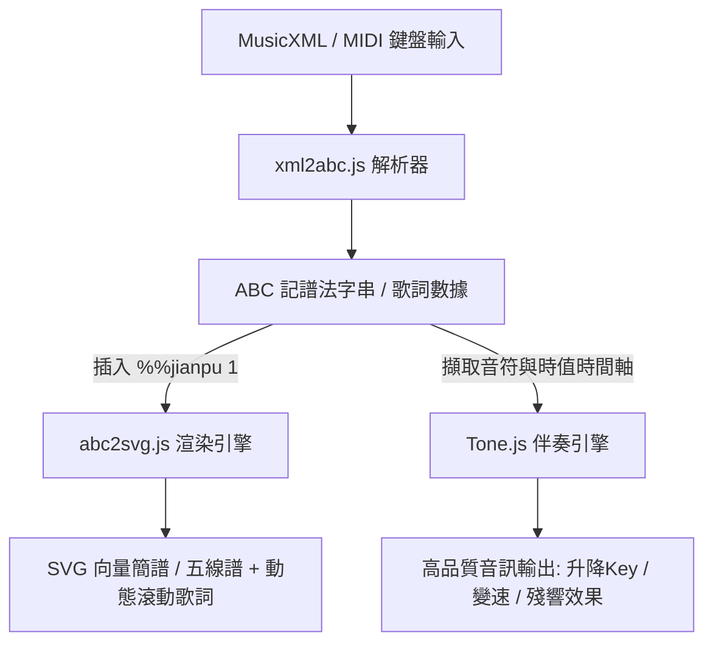

# Huan_Hi_Karaoke (歡喜卡拉OK)

一個結合 AI、簡譜/五線譜即時渲染與 Tone.js 的網頁版智慧卡拉OK與音樂創作平台。

本專案名稱靈感源自台語經典金曲《歡喜就好》（Huan-Hí-Tō-Hó），旨在讓音樂創作、看譜與歌唱體驗變得更加「簡單、歡喜就好」。

---

## 📌 專案願景與核心目標

在華人音樂圈（特別是流行樂自彈自唱、長者合唱團及國樂器演奏），**數字簡譜（Numbered Musical Notation / Jianpu）** 的使用需求極大。本專案旨在打造一個純前端、零伺服器成本的音樂平台，能夠：
1. **匯入/轉換**：讓使用者直接拖放任何 MusicXML 檔案，並在 0.01 秒內完成解析。
2. **多模態渲染**：一鍵在**「五線譜」**與**「首調數字簡譜」**之間無縫切換，並完美對齊歌詞。
3. **高品質伴奏**：利用 Tone.js 驅動的音訊引擎，實現高品質 Sampler 合成播放，提供即時的變速、升降 Key（變調）及導唱切換功能。
4. **AI 自動配樂**（未來規劃）：
   - 接收使用者透過 MIDI 鍵盤彈奏的單音主旋律。
   - 經由 JS 量化演算法校正拍值。
   - 透過 AI Agent（LLM API）自動進行調性分析、配和弦（Chord Progression）及生成雙聲部伴奏織體（例如鋼琴左手伴奏）。
   - 將 AI 生成的 MusicXML 重新渲染為帶和弦標記的簡譜，完成創作與播放閉環。

---

## 🛠️ 技術架構

本專案採用純網頁前端技術開發，以實現極速的本地運算與零伺服器維護成本。



### 關鍵運作原理：
* **`xml2abc-js`**：讀取 MusicXML XML 結構並翻譯為 ABC 記譜法。
* **`abc2svg` (簡譜的關鍵)**：由 Jean-François Moine 開發的網頁繪圖引擎，原生支援 `%%jianpu 1` 指令。當啟用時，會將 ABC 碼自動轉換為首調簡譜數字（如 `1 2 3 1`）並與歌詞對齊渲染。
* **`Tone.js`**：接管 Web Audio，配合高音質 Sampler 音源，並實現變調/變速等 KTV 必備功能。

---

## 📂 資料夾與相依專案說明

本專案集成了多個優秀的開源音樂工具：

* **[SelfPlayingMusic](file:///D:/01%20TASK/2024/20260720%20OpenKtvAI/SelfPlayingMusic)** (Git Submodule)
  * 專案的子模組，參考並整合網頁端自動伴奏與音訊播放的實作邏輯。
* **[xml2abc-js_122](file:///D:/01%20TASK/2024/20260720%20OpenKtvAI/xml2abc-js_122)** (第三方開源原始碼)
  * Wim Vree 開發的 `xml2abc-js` 轉換工具，用於在瀏覽器端將 MusicXML 解析轉換成 ABC Notation。
* **[xmlplay_188](file:///D:/01%20TASK/2024/20260720%20OpenKtvAI/xmlplay_188)** (第三方開源原始碼)
  * Wim Vree 開發的 `xmlplay` 網頁版樂譜播放器，內含 `abc2svg` 引擎與 `xmlplay.js` 核心控制程式。
* **[MUSIC](file:///D:/01%20TASK/2024/20260720%20OpenKtvAI/MUSIC)**
  * 用於測試的音樂檔案與 MusicXML 資源目錄。

---

## 🚀 開始使用與測試

### 1. 簡譜渲染本地測試
可以直接參考 `xmlplay_188` 中的 `xmlplay.html` 或 `xmlplay_emb.html` 來理解其如何載入 `xml2abc.js` 與 `abc2svg`。
若要在 ABC 代碼中啟用簡譜渲染，只需在音軌聲明中加入 `%%jianpu 1`：
```abc
X:1
T:兩隻老虎 (簡譜範例)
M:4/4
L:1/4
K:C
V:1
%%jianpu 1
C D E C | C D E C | E F G2 | E F G2 :|
w:兩 隻 老 虎, 兩 隻 老 虎, 跑 得 快, 跑 得 快,
```

### 2. 子模組初始化
如果您剛 clone 本專案，請確保初始化並更新子模組：
```bash
git submodule init
git submodule update
```

---

## 📝 專案開發藍圖 (Roadmap)

1. **第一階段：UI/UX 現代化改造**
   - 隱藏原版 `xmlplay` 較為傳統的學術介面。
   - 使用 CSS 與現代排版技術，設計出具備科技感與 KTV 伴奏質感的控制面板（播放、暫停、進度條、麥克風、升降 Key 控制）。
2. **第二階段：音訊引擎升級 (Tone.js Bridge)**
   - 讀取 ABC 記譜法解析出的音符與時間軸數據。
   - 繞過原生的 Web Audio 合成器，改由 **Tone.js Sampler** 載入高品質 Soundfont 樣音發聲。
   - 實現變速與升降 Key 功能。
3. **第三階段：歌詞動態走位 (Karaoke Lyrics Sync)**
   - 利用 `abc2svg` 的跟譜事件（Event Hook），抓取當前播放音符與時間。
   - 在網頁前端實現逐字/逐句高亮變色與滾動。
4. **第四階段：MIDI 輸入與 AI 創作功能**
   - 使用 Web MIDI API 錄製鍵盤演奏。
   - 實現 Quantization 量化演算法，將 MIDI 時間校正為標準音符長度。
   - 對接 AI (LLM) 自動配樂與聲部生成，提供創作協同。
